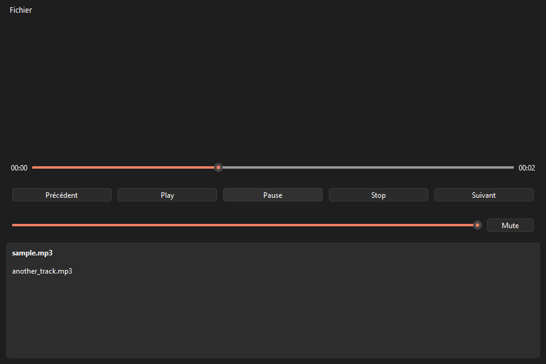

# Lecteur Média PyQt6


Lecteur audio/vidéo local, mono-utilisateur, construit avec Python et PyQt6/QtMultimedia. Projet portfolio personnel — pas un concurrent de VLC : pas de streaming réseau, pas de transcodage, pas de plugins tiers.



## Fonctionnalités (MVP)

- Lecture de fichiers vidéo (MP4) et audio (MP3) : play / pause / stop
- Barre de progression fidèle à la position de lecture, avec seek par clic/drag
- Réglage du volume et mute/unmute
- Playlist par glisser-déposer ou dialogue d'ouverture, navigation suivant/précédent, enchaînement automatique en fin de piste
- Messages d'erreur clairs (fichier corrompu ou format non supporté), sans crash de l'application
- Raccourcis clavier (espace, flèches gauche/droite pour le seek, haut/bas pour le volume)
- Couverture de tests >= 70 % sur `core/`

## Pour l'utilisateur final

Aucun binaire précompilé n'est publié pour l'instant (pas de release CI) : voir la section [Packaging](#packaging) ci-dessous pour générer un exécutable autonome (`.exe` / `.app` / binaire Linux) qui ne nécessite pas d'installer Python.

## Installation (développeur)

Prérequis : Python 3.11+ (testé avec Python 3.12).

```bash
python3 -m venv venv
source venv/bin/activate      # Windows : venv\Scripts\activate
pip install -r requirements.txt        # dépendances d'exécution (PyQt6, ...)
pip install -r requirements-dev.txt    # dépendances de dev (pytest, ruff, PyInstaller...)
```

Lancer l'application :

```bash
python main.py
```

Lancer les tests et le lint :

```bash
pytest
pytest --cov=core --cov-report=term-missing   # couverture sur core/
ruff check .
```

## Packaging

Un exécutable autonome (sans installation Python requise) peut être généré avec [PyInstaller](https://pyinstaller.org/) :

```bash
pip install -r requirements-dev.txt
pyinstaller media_player.spec
```

L'exécutable est produit dans `dist/media_player/` :
- **Windows** : `dist/media_player/media_player.exe`
- **macOS** : `dist/media_player/media_player.app`
- **Linux** : `dist/media_player/media_player`

`media_player.spec` est unique et partagé entre les trois plateformes (le bloc `BUNDLE` qui produit le `.app` macOS ne s'active que si le build tourne sur `darwin`).

**Point de vigilance FFmpeg (cf. PRD section 10) :** QtMultimedia dépend d'un plugin FFmpeg chargé dynamiquement à l'exécution (`Qt6/plugins/multimedia/ffmpegmediaplugin`). Les hooks PyInstaller pour PyQt6 l'embarquent automatiquement, mais il faut le vérifier après chaque build plutôt que de supposer que la présence de FFmpeg sur la machine de build suffit :
- **Windows/Linux** : vérifier que `ffmpegmediaplugin.dll` (ou `.so`) est bien présent sous `dist/media_player/_internal/PyQt6/Qt6/plugins/multimedia/` (ou équivalent selon le mode `--onefile`/`--onedir`).
- **macOS** : lancer `otool -L` sur le binaire final (`dist/media_player/media_player.app/Contents/MacOS/media_player`) pour confirmer que les bibliothèques FFmpeg sont liées depuis l'intérieur du bundle `.app`, pas depuis un chemin de la machine de build.

**Limite de vérification actuelle :** ce build a été généré et testé (lancement de l'exécutable, présence de `ffmpegmediaplugin.dll`) sur Windows uniquement — l'environnement de développement de ce projet ne dispose pas d'une machine macOS. La vérification `otool -L` du bundle `.app` reste à faire sur macOS avant packaging final.

## Documentation

- [`docs/PRD_Lecteur_Media_PyQt6.md`](docs/PRD_Lecteur_Media_PyQt6.md) — spécification produit/technique du MVP
- [`docs/USER_STORIES_Lecteur_Media_PyQt6.md`](docs/USER_STORIES_Lecteur_Media_PyQt6.md) — backlog détaillé, exécuté story par story
- [`docs/PRD_V2_Lecteur_Media_PyQt6.md`](docs/PRD_V2_Lecteur_Media_PyQt6.md) — pistes d'évolution après le MVP (repeat/shuffle, thèmes, sous-titres, etc.)

## Licence

Ce projet est sous licence **GNU GPLv3** — voir [`LICENSE`](LICENSE). Ce choix découle directement de celui de PyQt6 (lui-même GPLv3 ou commercial) : un dépôt public sous GPLv3 est la façon la plus simple de rester en conformité, le code source étant de toute façon public.
